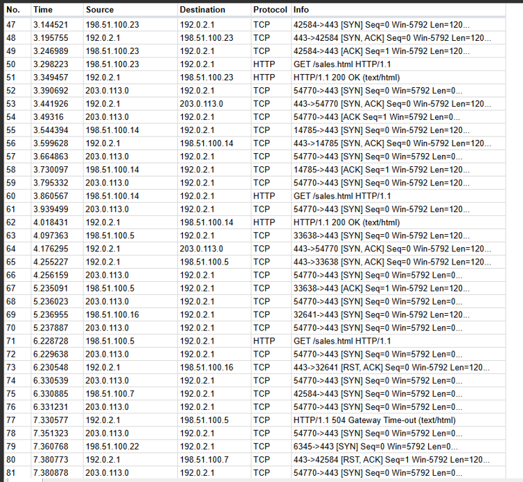
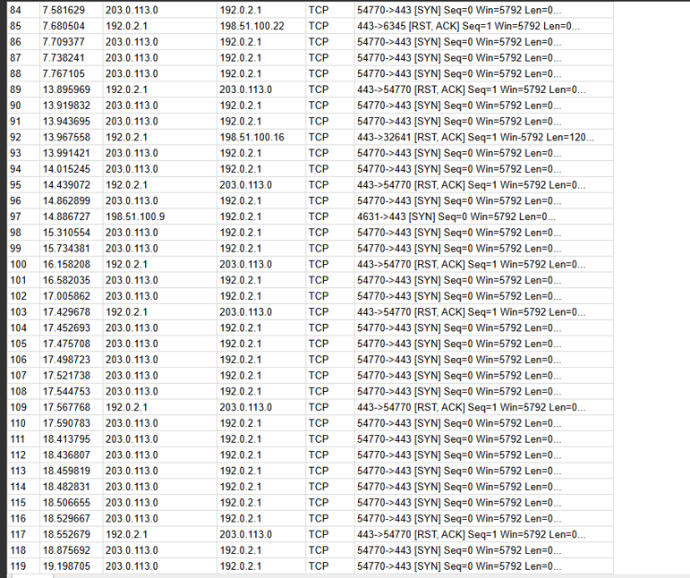
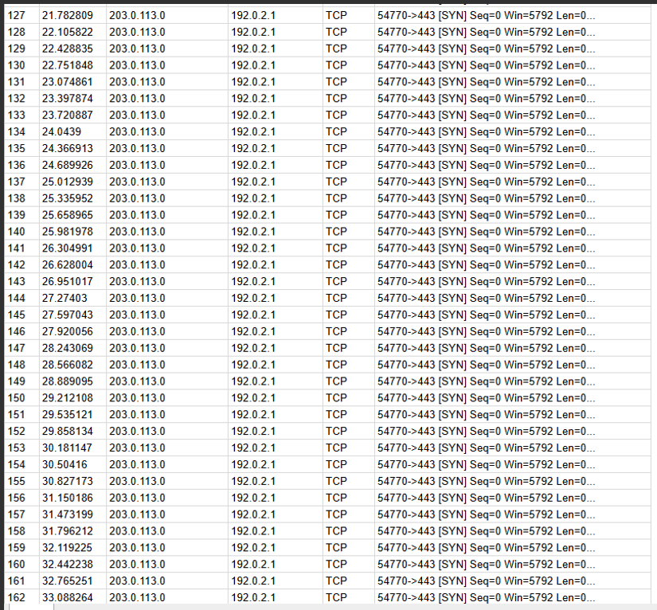
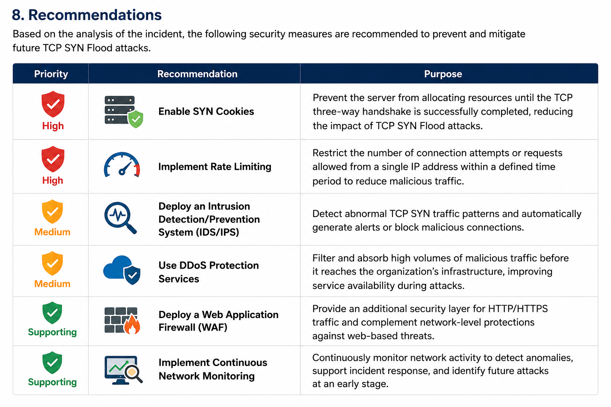

# TCP SYN Flood Attack Investigation


---

## Project Overview

This project documents the investigation of a simulated TCP SYN Flood attack that caused a denial-of-service condition on a web server. Using Wireshark packet analysis, the investigation identified abnormal TCP SYN traffic, analyzed the impact on server availability, determined the root cause, and proposed mitigation strategies based on industry best practices.

The project demonstrates practical skills in network traffic analysis, incident investigation, TCP/IP fundamentals, and cybersecurity documentation.

---

##  Objectives

- Analyze network traffic using Wireshark packet captures.
- Identify indicators associated with a TCP SYN Flood attack.
- Examine the impact of incomplete TCP handshakes on server availability.
- Determine the root cause of the service disruption.
- Recommend practical mitigation strategies based on cybersecurity best practices.
- Develop professional incident response documentation suitable for a cybersecurity portfolio.

---

##  Investigation Scenario

A travel agency reported that its public web server became unavailable after users experienced repeated connection timeout errors.

Packet capture analysis revealed a significant number of TCP SYN packets originating from a single external IP address. The attacker continuously initiated TCP connections without completing the three-way handshake, causing thousands of half-open connections that exhausted server resources and disrupted normal web services.

---

##  Investigation Summary

| Category | Details |
|----------|---------|
| **Incident Type** | TCP SYN Flood (Denial-of-Service) |
| **Target System** | Travel Agency Web Server |
| **Affected Protocol** | TCP |
| **Target Port** | 443 (HTTPS) |
| **Attacker IP** | 203.0.113.0 |
| **Target IP** | 192.0.2.1 |
| **Analysis Tool** | Wireshark |
| **Impact** | Server resource exhaustion resulting in website unavailability |
| **Root Cause** | Excessive incomplete TCP three-way handshakes (half-open connections) |

---

##  Investigation Findings

### Evidence 1 – Initial SYN Flood Activity



A large number of TCP SYN packets originating from **203.0.113.0** were observed targeting the organization's web server. The continuous connection requests indicate the beginning of the TCP SYN Flood attack.

---

### Evidence 2 – Repeated TCP SYN Packets



The attacker repeatedly transmitted TCP SYN packets to port **443** without completing the TCP three-way handshake, causing the server to maintain thousands of half-open connections.

---

### Evidence 3 – Service Disruption



As the number of half-open connections increased, legitimate HTTP traffic began to fail, resulting in connection timeouts and reduced service availability.

---


##  Root Cause

The attack exploited the TCP connection establishment process by continuously sending TCP SYN packets without completing the three-way handshake. As a result, the server accumulated thousands of half-open TCP connections, exhausting available resources and preventing legitimate users from accessing the web application.

---

##  Mitigation Recommendations

The following security controls are recommended to reduce the impact of TCP SYN Flood attacks and improve the organization's resilience against future denial-of-service incidents.



---

##  Skills Demonstrated

| Technical Skills | Investigation Skills |
|-----------------|----------------------|
| Wireshark Packet Analysis | Incident Investigation |
| TCP/IP Fundamentals | Root Cause Analysis |
| Packet Inspection | Threat Identification |
| Network Traffic Analysis | Security Documentation |
| HTTP Traffic Analysis | Incident Reporting |

---

##  Project Structure

```text
TCP-SYN-Flood-Attack-Investigation
│
├── README.md
├── LICENSE
├── .gitignore
│
├── images
│   ├── evidence1-syn-flood.png
│   ├── evidence2-repeated-syn.png
│   ├── evidence3-resource-exhaustion.png
│   └── recommendations-table.png
│
└── reports
    └── Incident_Report.pdf
```

---

## 📄 Full Report

The complete technical incident report, including the investigation methodology, packet analysis, evidence, root cause, mitigation recommendations, and conclusions, is available in:

📄 **reports/Incident_Report.pdf**